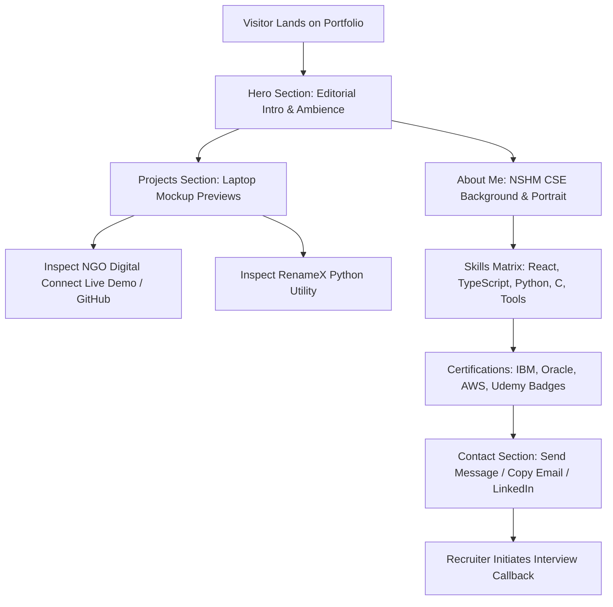

# PRD.md — Product Requirements Document
**Project Name:** Sujoy Layek — Developer Portfolio  
**Version:** 1.0.0  
**Status:** Approved  
**Date:** 2026-10-08  

---

## 1. Product Overview

### What it is
A high-end, editorial personal developer portfolio website inspired by `lewiszhang.dev`. It presents Sujoy Layek's identity as a B.Tech CSE student and Full-Stack Developer through dark ambient mesh gradients, interactive laptop/device project mockups, smooth 60fps micro-interactions, an interactive skills matrix, verified credentials, and a direct contact form.

### What it is NOT
- It is NOT a generic template or cookie-cutter static page.
- It is NOT a dynamic content management system (CMS) with an admin dashboard or user login.
- It is NOT an e-commerce or paid services portal.

---

## 2. Problem Statement

### Who has the problem
Tech recruiters, hiring managers, hackathon organizers, and engineering leads reviewing developer resumes.

### What hurts today
Tech recruiters review hundreds of resumes and portfolios daily. Generic templates, PDF resumes without visual context, and poorly styled static sites fail to showcase a developer's real design sensibilities, full-stack capabilities, and practical engineering skills.

### Why this solves it
By combining an editorial dark aesthetic, live project mockups (specifically highlighting the hackathon-winning *NGO Digital Connect* and Python utility *RenameX*), and interactive credential badges with direct proof of skills, this portfolio provides immediate credibility and makes an unforgettable visual impression.

---

## 3. Product Vision

### First Version (v1.0.0 — MVP)
A fast, fully responsive Single Page Application built with Next.js, Tailwind CSS, and Framer Motion, featuring:
- Hero banner with editorial typography and ambient glow.
- Featured Projects section showcasing *NGO Digital Connect* and *RenameX* inside laptop mockups.
- About section with Sujoy's professional suit portrait and NSHM Knowledge Campus academic background.
- Skills & Tech Stack matrix.
- Certifications & Accreditations badges (IBM, Oracle, AWS, Udemy).
- Functional contact form delivering messages straight to Gmail, plus 1-click email copy.
- 100% mobile and tablet responsive layout with a custom cursor.
- Deployed on Vercel with zero hosting cost.

### Later Versions (Post-MVP / Roadmap)
- Addition of secondary projects (*RenameX*, *MultiFileMaker*, interactive CSS experiments).
- Ambient background sound toggle.
- Blog / technical writing section.

---

## 4. Target Users

| User Type | Their Situation | Their Pain | Our Value |
|---|---|---|---|
| **Tech Recruiters** | Scanning dozens of candidate profiles for internships/junior full-stack roles | Hard to tell if a candidate has real-world building experience from a plain text resume | Instant visual proof of working projects via interactive laptop previews and direct GitHub links |
| **Engineering Leads** | Assessing code quality and architectural maturity | Candidates often only have tutorial-level clone projects | Highlights high-impact hackathon work (*NGO Digital Connect*) and CLI tools (*RenameX*) with clear tech breakdowns |
| **Academic & Hackathon Peers** | Looking for collaboration and team members | Hard to find reliable full-stack teammates | Clearly showcases demonstrated skills, certifications, and direct contact channels |

---

## 5. Core Use Cases

- **UC-01 (First Impression & Navigation):** A recruiter lands on the site, immediately reads Sujoy's headline, observes the smooth ambient gradients and custom cursor, and uses the minimalist menu to jump directly to projects.
- **UC-02 (Explore Flagship Project):** A visitor scrolls to the Projects section, observes *NGO Digital Connect* inside a laptop mockup frame, reads the role/stack breakdown, clicks "Explore Live Website" to view the live app on Vercel, or clicks "Source Code" to view the GitHub repository.
- **UC-03 (Explore Developer Utility):** A visitor views *RenameX*, reads the utility description (bulk file extension modifier built with Python), and visits the GitHub repo.
- **UC-04 (Verify Credentials & Education):** A hiring manager navigates to the About & Certifications section, reads Sujoy's B.Tech CSE background at NSHM Knowledge Campus Durgapur, sees his professional portrait, and reviews verified credentials from IBM, Oracle, AWS, and Udemy.
- **UC-05 (Direct Contact & Outreach):** A recruiter decides to reach out, fills in their name, email, and message in the contact form, and clicks Send. The form forwards the inquiry directly to Sujoy's Gmail inbox via Web3Forms/Formspree with zero server downtime. Alternatively, the recruiter clicks the "Copy Email" button to paste it into their own mail client.

---

## 6. User Journey

---

## 7. Functional Requirements

| ID | Title | Tier | Description |
|---|---|---|---|
| **FR-001** | Hero Section | MVP | Displays brand title ("Sujoy."), navigation menu, editorial headline, and ambient mesh gradient background. |
| **FR-002** | Custom Cursor | Removed | Excluded based on user preference (native cursor restored). |
| **FR-003** | Laptop Mockup Project Showcase | MVP | Interactive laptop frame showcasing *NGO Digital Connect* with live demo URL, role, year, and GitHub repository links. |
| **FR-004** | Secondary Project Showcase | MVP | Showcase *RenameX* (Python automation tool) with metadata, project overview, and GitHub link. |
| **FR-005** | About Me Section | MVP | Profile section featuring Sujoy's professional suit portrait, bio, B.Tech CSE at NSHM Knowledge Campus Durgapur, and personal interests. |
| **FR-006** | Skills & Tech Stack Matrix | MVP | Organized grid/pills displaying Frontend (React, Next.js, Tailwind), Languages (TypeScript, JavaScript, Python, C), Backend/APIs, and Tools (Git, GitHub, Vercel). |
| **FR-007** | Certifications & Accreditations Badges | MVP | Sleek credential cards displaying issuing organizations (IBM, Oracle, AWS, Udemy), certificate titles, and verification links. |
| **FR-008** | Working Contact Form | MVP | Serverless contact form integrated with Web3Forms/Formspree forwarding submissions to `sujoylayek.rampur.2006@gmail.com`. |
| **FR-009** | 1-Click Copy Email & Social Links | MVP | One-click button to copy email address to clipboard with visual feedback, plus direct links to LinkedIn and GitHub. |
| **FR-010** | Resume Action Button | MVP | Prominent button in navigation and bio to view/download resume (with placeholder until final PDF is linked). |
| **FR-011** | Mobile & Tablet Responsiveness | MVP | Fully responsive layout adapting all mockups, navigation, and typography gracefully across all viewport sizes. |
| **FR-012** | Secondary Projects Expansion | MVP | Inclusion of additional projects (*MultiFileMaker*, *RenameX*) into the multi-slide showcase. |
| **FR-013** | Ambient Audio | Removed | Excluded based on user preference (zero sound). |
| **FR-014** | Interactive 3D Particle Galaxy Canvas | MVP | Interactive HTML5 Canvas / WebGL swirling particle galaxy in Hero reacting to mouse movement. |
| **FR-015** | Condensed Editorial Hero Typography | MVP | High-fashion condensed bold uppercase title ("BUILDING YOUR DIGITAL VISION") matching Lewis Zhang layout. |
| **FR-016** | Infinite Scrolling Marquee Banner | MVP | Smooth horizontal ticker displaying engineering skills and vision phrases with seamless loop. |
| **FR-017** | 3D Laptop Slider Stage | MVP | Stage with interactive slide/drag switching across projects with `(01)`, `(02)` counters and "View Detail" pill. |
| **FR-018** | High-Contrast Editorial Footer | MVP | Dedicated "Let's work together" transition section with "Connect With Me" button and `↑` Back-to-Top scroll control. |

---

## 8. Non-Functional Requirements

- **Performance (Assumption):** Page loads in < 1.5 seconds (LCP). Images converted and served in WebP format. 60fps animations via GPU-accelerated CSS/Framer Motion.
- **Security:** Zero client-side API keys exposed. Zero database storage of contact messages. Contact form protected against automated bots with a honeypot field.
- **Reliability:** 99.99% uptime powered by Vercel Global Edge CDN.
- **Cross-Browser & Platform Compatibility:** Flawless rendering on modern Chromium browsers, Safari (iOS/macOS), and Firefox across Mobile, Tablet, and Desktop viewports.
- **Code Standards & Architecture:** Strict TypeScript type checking, modular component breakdown, ESLint compliance, and green builds after every change.

---

## 9. Success Criteria

1. **Working Production Deployment:** Site live on Vercel with zero console errors or hydration warnings.
2. **Speed & Lighthouse Score:** Google Lighthouse performance score of 90+ on desktop and mobile.
3. **Verified Functional Contact Flow:** At least one test submission successfully forwarded from the web form to `sujoylayek.rampur.2006@gmail.com`.
4. **Fidelity to Lewis Zhang Aesthetic:** High-contrast editorial typography, dark mesh ambient lighting, and laptop mockup styling verified visually.

---

## 10. Out of Scope

1. User registration, login, or session management.
2. Relational or NoSQL database storage (static Next.js configuration is used).
3. CMS or admin portal for editing projects (updates made directly in structured code/JSON).
4. Payment gateway or checkout systems.
5. In-browser audio production/recording.

---

## 11. Assumptions and Open Questions

### Assumptions (AI Suggested Defaults)
- **Assumption 1:** Web3Forms or Formspree free tier will be used to handle form submission forwarding directly to Gmail without backend servers.
- **Assumption 2:** Local optimized WebP image assets will be used for Sujoy's portrait and laptop mockup graphics.
- **Assumption 3:** A temporary placeholder resume link will be used until Sujoy provides the final PDF URL.

### Open Questions (Decisions Still Needed)
- **Open Question 1:** What exact credential IDs and verification URLs should be linked for the IBM, Oracle, AWS, and Udemy certificates? (Placeholders will be prepared in code so they can be filled in anytime).
- **Open Question 2:** Will a custom domain (e.g. `sujoylayek.dev`) be mapped to Vercel later, or will the default `*.vercel.app` domain be used initially?
