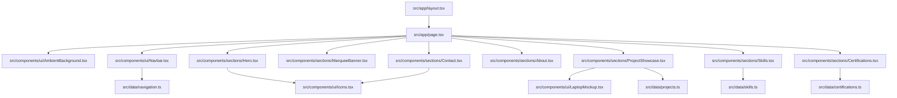

# Architecture & System Design — Sujoy Layek Developer Portfolio

**Version:** 1.0.0  
**Framework:** Next.js 16 (App Router / Turbopack)  
**Language:** TypeScript 5  
**Styling:** Tailwind CSS 4  
**Animation:** Framer Motion  

---

## 1. Directory Structure

```text
├── docs/
│   ├── PRD.md                       # Product Requirements Document
│   └── architecture.md              # System design & architecture specification
├── public/
│   ├── fonts/
│   │   └── george.woff2             # Editorial display font
│   ├── images/
│   │   ├── projects/                # Real application showcase screenshots
│   │   │   ├── MultiFileMaker.png
│   │   │   ├── NGO1.png
│   │   │   ├── NGO2.png
│   │   │   ├── NGO3.png
│   │   │   ├── NGO4.png
│   │   │   └── RenameX.png
│   │   └── sujoy-profile.jpg        # Sujoy Layek portrait portrait
│   └── models/                      # 3D assets & particle buffers
├── src/
│   ├── app/                         # Next.js App Router root
│   │   ├── favicon.ico
│   │   ├── globals.css              # Tokens, @font-face & ambient utilities
│   │   ├── layout.tsx               # Root layout, meta tags & fonts
│   │   ├── page.tsx                 # Home single-page component layout
│   │   ├── robots.ts                # Search bot crawler rules
│   │   └── sitemap.ts               # XML sitemap generator
│   ├── components/
│   │   ├── archive/                 # Experimental / alternative components
│   │   │   ├── CustomCursor.tsx
│   │   │   └── ParticleGalaxy.tsx
│   │   ├── sections/                # High-level page sections
│   │   │   ├── About.tsx            # Engineering philosophy & education
│   │   │   ├── Certifications.tsx   # Verified credentials & badges
│   │   │   ├── Contact.tsx          # Serverless contact form & footer
│   │   │   ├── Hero.tsx             # Editorial intro & status indicators
│   │   │   ├── MarqueeBanner.tsx    # Infinite looping vision marquee
│   │   │   ├── ProjectShowcase.tsx  # 3D perspective slider stage
│   │   │   └── Skills.tsx           # Categorized capability matrix
│   │   └── ui/                      # Reusable UI primitives
│   │       ├── AmbientBackground.tsx# Floating radial glow mesh
│   │       ├── Icons.tsx            # SVG brand iconography
│   │       ├── LaptopMockup.tsx     # MacBook hardware frame
│   │       └── Navbar.tsx           # Editorial header & drawer
│   ├── data/                        # Decoupled portfolio content data
│   │   ├── certifications.ts        # Certification records & credentials
│   │   ├── navigation.ts            # Menu links & social profile endpoints
│   │   ├── projects.ts              # Featured projects & metadata
│   │   └── skills.ts                # Skill categories & tech stack items
│   ├── lib/                         # Utility helpers
│   │   └── utils.ts                 # Class merger helper (`cn`)
│   └── types/                       # TypeScript interfaces
│       └── index.ts                 # Shared entity types
├── .gitignore                       # Clean Git exclusion rules
├── BACKLOG.md                       # Task tracking & phases
├── eslint.config.mjs                # ESLint configuration
├── next.config.ts                   # Next.js runtime configuration
├── package.json                     # Project manifest & scripts
├── PHASES.md                        # Phase milestones
├── PROGRESS.md                      # Session memory & changelog
├── PROJECT_BRIEF.md                 # Project interview outcomes
├── README.md                        # Public repository presentation
└── tsconfig.json                    # TypeScript compiler options
```

---

## 2. Component Hierarchy & Flow



---

## 3. Data Architecture & Separation of Concerns

1. **Decoupled Data Layer (`src/data/`)**:
   - All text copy, project descriptions, skills, certifications, and URLs are isolated in standalone TypeScript files.
   - Adding a new project or updating a certificate never requires touching JSX styling or component lifecycle logic.
2. **Modular UI Elements (`src/components/ui/`)**:
   - General-purpose presentation wrappers (e.g., `LaptopMockup`, `Icons`, `Navbar`, `AmbientBackground`) are isolated from page-specific layouts.
3. **Structured Page Sections (`src/components/sections/`)**:
   - Each section is independently mounted, client-interactive where required (`use client`), and isolated for performance and maintainability.
